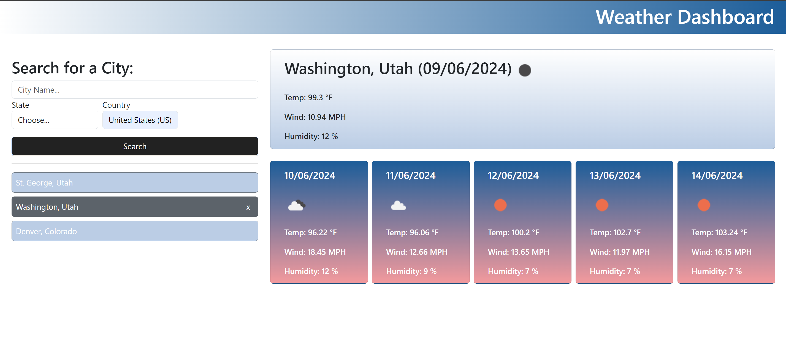

# Weather-Dashboard

## Description

This is a summary of what I did for the week 6 challenge. This was a gorund up challenge with no starter code. I built everything from scratch.

What I needed to impliment:

    GIVEN a weather dashboard with form inputs
    WHEN I search for a city
    THEN I am presented with current and future conditions for that city and that city is added to the search history
    WHEN I view current weather conditions for that city
    THEN I am presented with the city name, the date, an icon representation of weather conditions, the temperature, the humidity, and the wind speed
    WHEN I view future weather conditions for that city
    THEN I am presented with a 5-day forecast that displays the date, an icon representation of weather conditions, the temperature, the wind speed, and the humidity
    WHEN I click on a city in the search history
    THEN I am again presented with current and future conditions for that city

## How to use the Weather-Dashboard

    Click the input field City Name...
    Type in a valid city name
    Select the appropriate State
    The country is predefinded as US (maybe change that later)
    Click the search button.
    You will see a forecast displayed for the searched city.
    A new button with the searched city will also display below the search button
    This button when clicked will refresh and display the forecast again.
    You can also delete the button if you no longer want that city to display.

    Notes:
    I have a default city set up for the start. Once you start searching you can delete the default city.
    Once you have made searches your last search will always be displayed on page refresh even if you delete the city button.

## This is a link to my published webpage - [Weather Dashboard](https://rhinosstuff.github.io/Weather-Dashboard/)

